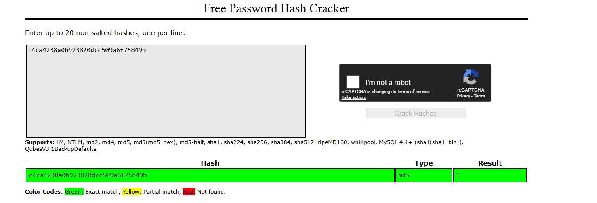
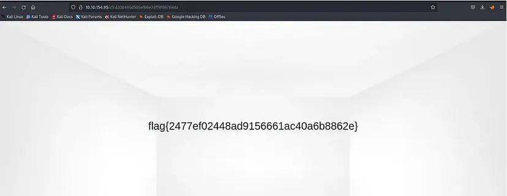

# TryHackMe - Corridor

**Link:** https://tryhackme.com/room/corridor

## Description

This is a web exploitation challenge from TryHackMe that focuses on discovering and exploiting Insecure Direct Object Reference (IDOR) vulnerabilities.

- **Challenge category:** Web Exploitation
- **Difficulty level:** Easy
- **Platform:** TryHackMe
- **Challenge prompt:** "In this challenge, you will explore potential IDOR vulnerabilities. Examine the URL endpoints you access as you navigate the website and note the hexadecimal values you find (they look an awful lot like a hash, don't they?). This could help you uncover website locations you were not expected to access."

### What is IDOR?

Insecure Direct Object References (IDOR) are a type of access control vulnerability that arises when an application uses user-supplied input to access objects directly. As a result of this vulnerability, attackers can bypass authorization and access resources in the system directly, for example, database records or files.

## Solution

### Initial Analysis and Observations

After deploying the machine, I navigated to the target IP address in the browser. The webpage displays a corridor with 13 doors:


Clicking on any door redirects to another webpage indicating that the door is opened, but none of them contain the flag.

### Tools Used

- **Web Browser** - For navigation and URL manipulation
- **CrackStation** - Online hash identifier tool for MD5 hash cracking

### Step-by-Step Approach

#### 1. URL Analysis

Since this is an IDOR challenge and the URLs contain hash-like values, I examined the URL structure when clicking on door 1:

```
http://MACHINE_IP/c4ca4238a0b923820dcc509a6f75849b
```

The hash value appears to be an MD5 hash (32 hexadecimal characters).

#### 2. Hash Identification

I used CrackStation to identify what the hash value corresponds to:



The result indicates that the hash `c4ca4238a0b923820dcc509a6f75849b` corresponds to the number `1`.

This confirms that each door number is MD5-hashed and used as the URL path.

#### 3. Testing Sequential References

After recognizing the pattern, I initially attempted to crack the hash values for all 13 doors (1-13), but none of them led to the flag. 

### Key Insights or Techniques

The key insight was recognizing that in IDOR vulnerabilities, developers might use simpler sequential references starting from `0` rather than `1`. Since we only have doors numbered 1-13 visible, door `0` might be hidden but still accessible.

#### 4. Finding the Hidden Door

I calculated the MD5 hash of `0`:

```
MD5(0) = cfcd208495d565ef66e7dff9f98764da
```

Then modified the URL to access door `0`:

```
http://MACHINE_IP/cfcd208495d565ef66e7dff9f98764da
```

### Final Exploit or Solution Method

Navigating to the URL with the MD5 hash of `0` revealed the hidden page containing the flag:



Success! The flag was located in the hidden "door 0" that wasn't visible in the UI.

### Flag

<Details>
<summary>Spoiler</summary>

```
flag{2477ef02448ad9156661ac40a6b8862e}
```
</Details>

**Lesson learned:** When testing IDOR vulnerabilities with sequential IDs, always remember to check for zero-indexed values and negative numbers, as they may provide access to hidden or administrative resources.
